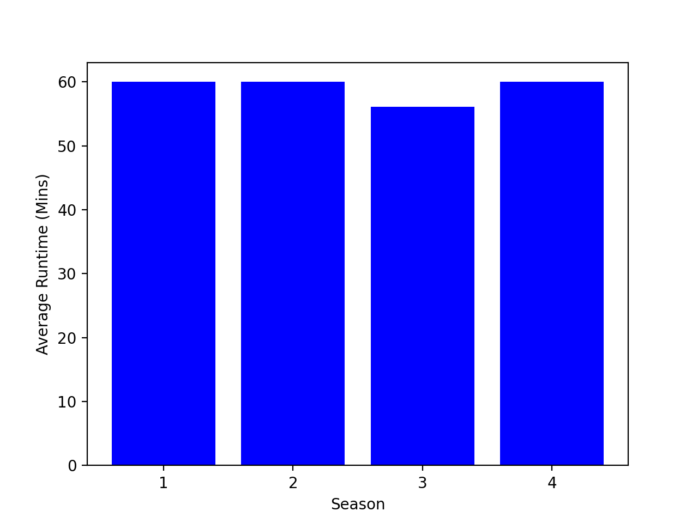

# MariaGergesHW
Discription of My Data Visualization Project For CS40
# First Plot 

## Runtime/episode for each season of Stranger Things

## Gross national income per capita (PPP int. $) / Year AND Neonates protected at birth against neonatal tetanus (PAB) (%)/ Year

Here's a link for more info: https://www.si.edu/spotlight/ancient-egypt/pyramid
