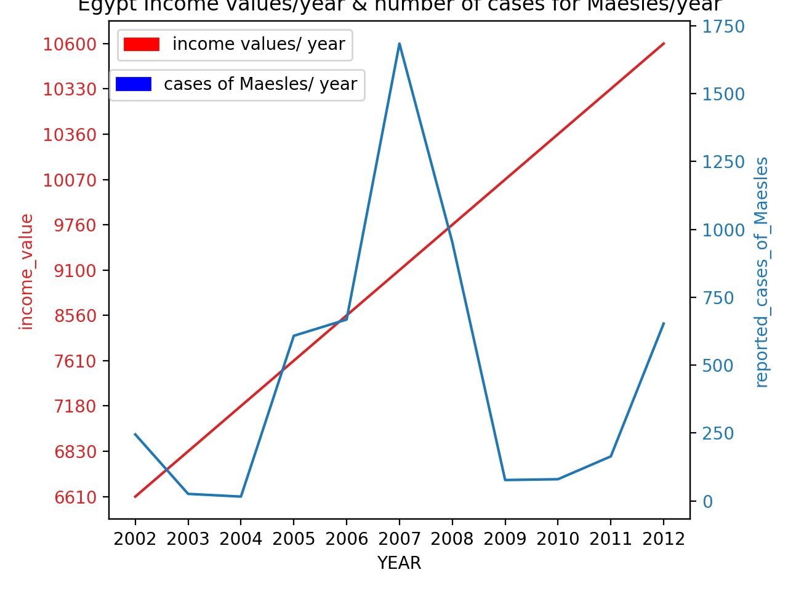

# MariaGergesHW
Discription of My Data Visualization Project For CS40
# First Plot 

## Average Runtime for each season of Stranger Things

Here's a link for the data used to make the graph: http://api.tvmaze.com/singlesearch/shows?q=stranger-things&embed=episodes

# Second Plot 
## Gross national income per capita (PPP int. $) / Year & Measles - number of reported cases)/ Year

Here's a link for the data used to make the graph: https://apps.who.int/gho/data/node.country.country-EGY?lang=en

Here's the project webpage:  https://github.com/mikeizbicki/cmc-csci040/tree/2020fall/hw_02
