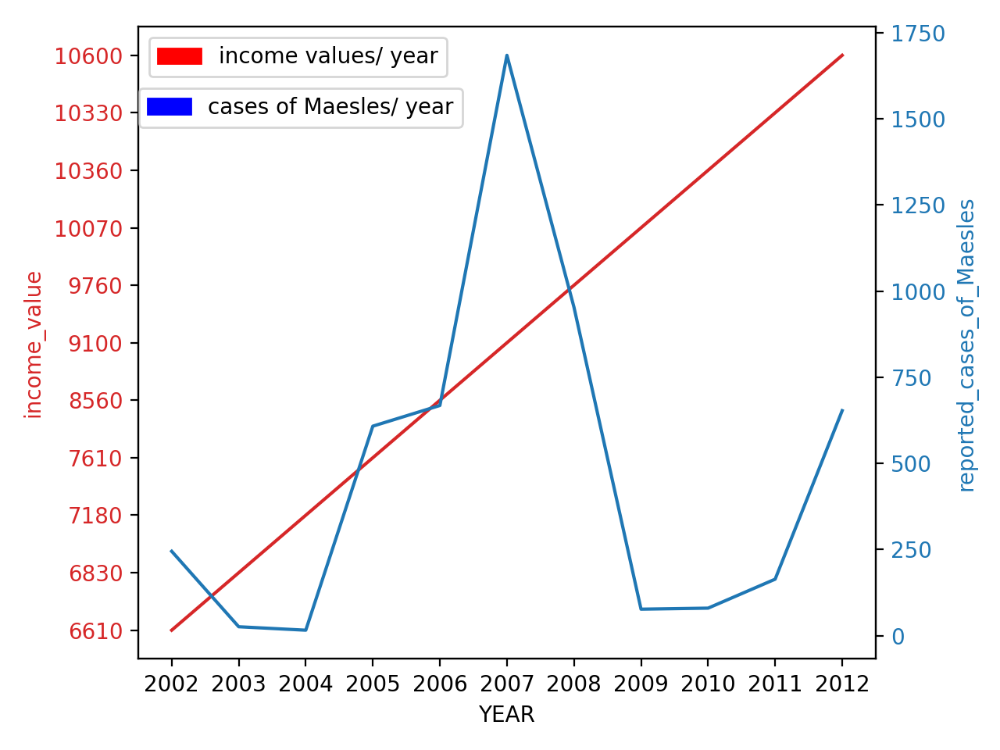

# MariaGergesHW
Discription of My Data Visualization Project For CS40
# First Plot 

## Average Runtime for each season of Stranger Things

This data represents the average of the values of runtimes for each episode for each season in the data. The data shows that season three had the lowest average runtime meaning it was the least sucessful season of Stranger Things.

Here's a link for the data used to make the graph: http://api.tvmaze.com/singlesearch/shows?q=stranger-things&embed=episodes

# Second Plot 
## Gross national income per capita (PPP int. $) / Year & Measles - number of reported cases/ Year

The red line graph represents the increase in the Gross national income per capita (PPP int. $) in Egypt throughtout the years. 
The bluse graph represents the number of reported cases for Maesles throughout the years, the graph shows a clear spike in the number of cases in 2007. 

Here's a link for the data used to make the graph: https://apps.who.int/gho/data/node.country.country-EGY?lang=en

Here's the project webpage:  https://github.com/mikeizbicki/cmc-csci040/tree/2020fall/hw_02
